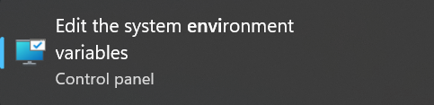
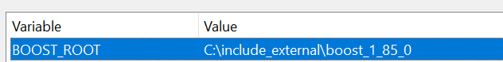

# Playlist Creator

This project is about creating playlists for users. It allows users to manage their playlists, generate random playlists, view their favorite songs, and much more.

## Prerequisites

Before you can build and run this project, you need to install the Boost library and add it to your system's PATH variables.

### Installing Boost

1. Download the Boost library from the official website: [Boost Libraries](https://www.boost.org/).
2. Extract the downloaded files to a directory of your choice.
3. Follow the installation instructions provided by Boost to compile and install the library.

### Adding Boost to PATH (Linux) -- This part could not work because i din't try to run it on linux yet (and also probably should add in cmake 2 difrent compilation procese depenndin on system)

1. Open your system's environment variables settings.
2. Add the path to the Boost library's `lib` and `include` directories to the PATH environment variable.
   - On Windows: This can typically be done by searching for "Environment Variables" in the Start menu, and editing the PATH variable in the System Properties window.
   - On Linux/macOS: You can add the following lines to your `.bashrc` or `.bash_profile` file:
     ```sh
     export BOOST_ROOT=/path/to/boost
     export PATH=$BOOST_ROOT/lib:$PATH
     export CPATH=$BOOST_ROOT/include:$CPATH
     export LIBRARY_PATH=$BOOST_ROOT/lib:$LIBRARY_PATH
     ```
   - Replace `/path/to/boost` with the actual path to your Boost installation.

### Adding Boost to PATH (Window) -- Works
1. Open your system's environment variables settings.

2. Add new enviromet varible 



## Building the Project

To build the project, follow these steps:

1. Navigate to the project's root directory.
2. Create a build directory (just run cmake file in hiest level)

## Run Program

You will find 2 exe files in build directory server(.\build\Server\Server.exe) and  client (.\build\Client\Client.exe) just run server first and then client and try firt demo version of program.